<table>
<td valign="middle" width="288">

</td>
<td valign="middle" width="500">

</td>

</tr>
</table>

## Héctor Olivares Sánchez

**Full Stack Developer | Web Development · Cross-Platform Applications | AI · Big Data**

&nbsp;

&nbsp;

